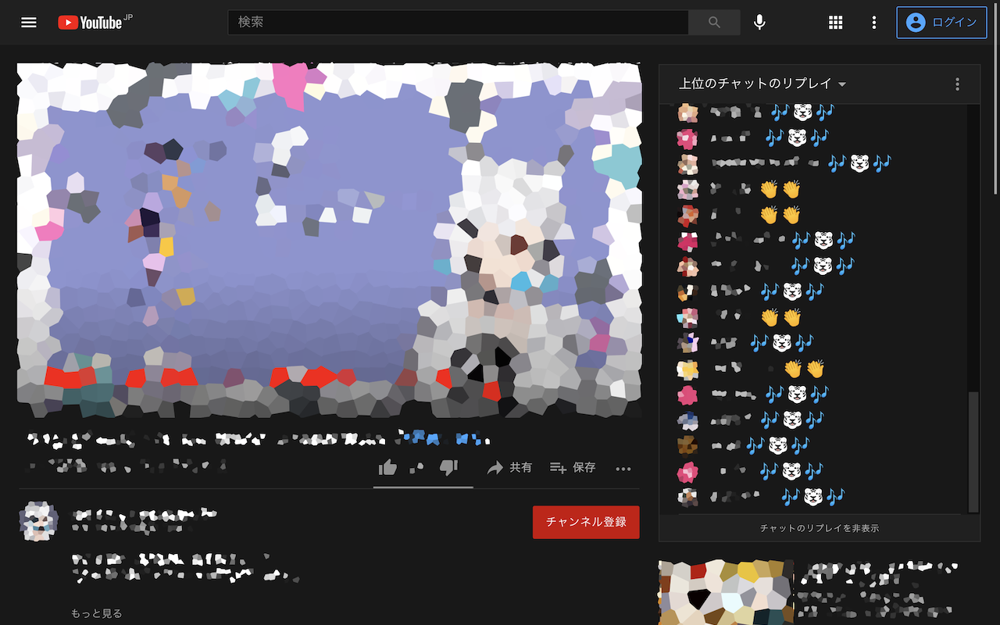

# ホワイトタイガーモード for YouTube

YouTubeのチャット欄の虎の絵文字をホワイトタイガーに変えるChrome拡張です。

## インストール

Chrome Web Storeにて公開中です。

https://chrome.google.com/webstore/detail/ealjjemhbhmfibikkcimhbhgaoiobakf

上記のURLからアクセスしてご利用ください。

## 対応ブラウザ

### Google Chrome

バージョン88以降のGoogle Chromeに対応しています。

### Microsoft Edge

Chromeベースの新しいバージョンのMicrosoft Edgeに対応しています。詳しくは、

https://support.microsoft.com/ja-jp/microsoft-edge/9c0ec68c-2fbc-2f2c-9ff0-bdc76f46b026

をご覧ください。

## 使い方

ONになっているあいだ、チャット欄の虎の絵文字が自動的にホワイトタイガーのデザインのものに置き換えられます。

ツールバーにある拡張機能のアイコンをクリックすることでON（）とOFF()が切り替えられます。

## プライバシーについて

本拡張機能は端末上でのみ動作し、ブラウザによって自動的に行われる設定の同期を除いて、外部との通信を行わないよう設計されています。

そのため製作者が受け取る利用者についての情報はChrome Web Storeを介してGoogleより提供されるインストール数等の統計情報のみで、その他の情報を本拡張機能を通して意図的に収集することは一切ありません。

## ライセンス

本拡張機能はApache-2.0ライセンスのもと公開されています。

詳しくは[LICENSE](LICENSE)ファイルを参照してください。

### 画像ファイル

各種画像ファイルは[Noto Emoji]のソースファイルを加工して作成しました。

[Noto Emoji]: https://github.com/googlefonts/noto-emoji

元となったファイルのライセンスについては、

https://github.com/googlefonts/noto-emoji/blob/948b1a7f1ed4ec7e27930ad8e027a740db3fe25e/svg/LICENSE

をご参照ください。
